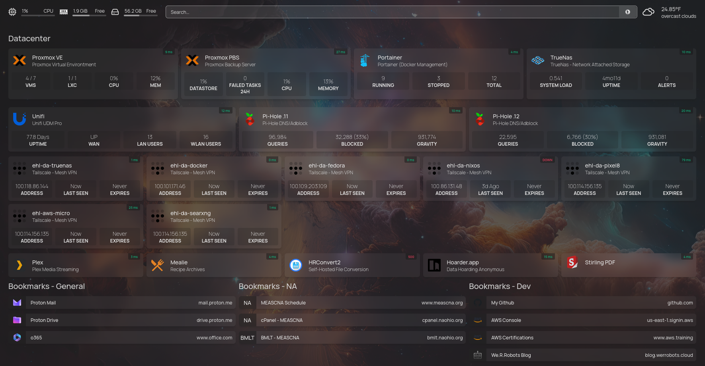
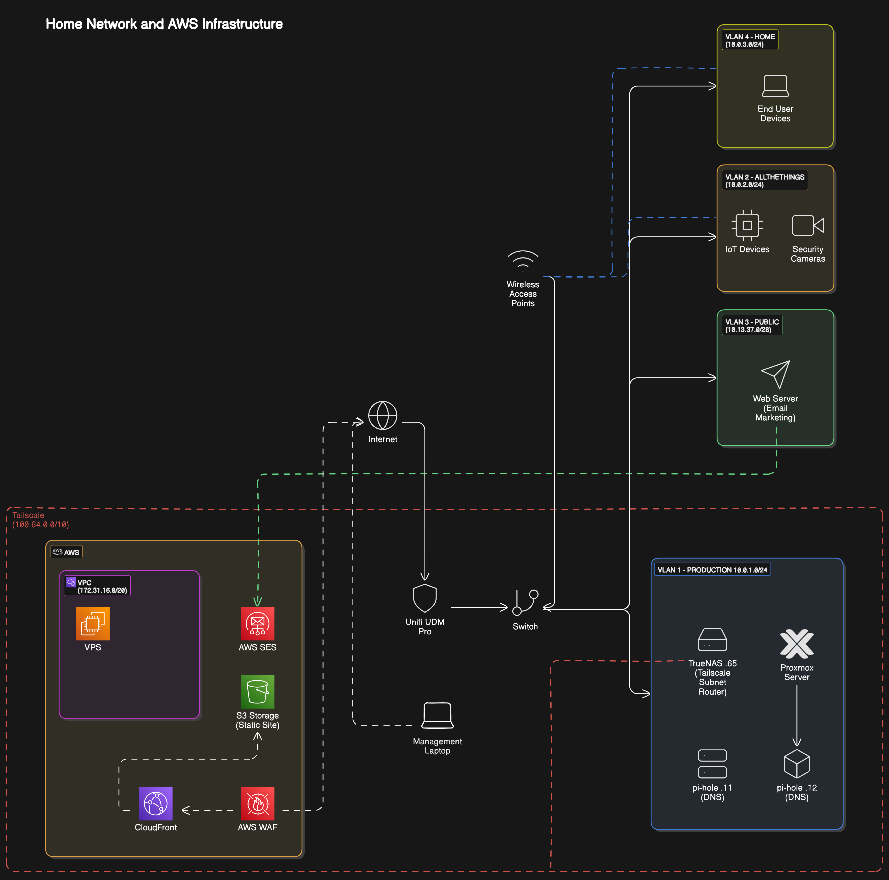

# 🏠 Homelab Documentation

## Overview

This document describes the infrastructure and services running in my personal homelab environment, which combines Local Hardware with an AWS VPC and cloud services. 

## Network Architecture

### Network Equipment

- UniFi UDM Pro - Primary Router/Firewall
- UniFi 24 Port Switch - Core network switching
- UniFi 8 Port PoE - Core WiFi switching
- TrueNAS (.65) - Network Storage
- Wireless Access Points for network distribution

### VLANs

- **VLAN 1 - PRODUCTION** (10.0.1.0/24)
	- Core infrastructure services
- **VLAN 2 - ALLTHETHINGS** (10.0.2.0/24)
	- IoT devices
	- Security cameras
- **VLAN 3 - PUBLIC** (10.13.37.0/24)
	- Web server (Email Marketing)
- **VLAN 4 - HOME** (10.0.3.0/24)
	- Primary network for end-user devices

### DNS Management

- **Pi-hole (Primary)** - pi-hole.11
	- DNS and Ad-blocking
	- 100,828 queries
	- 34,272 (34%) blocked queries
	- 931,774 gravity list size

- **Pi-hole (Secondary)** - pi-hole.12
	- Redundant DNS server
	- 22,886 queries
	- 6,802 (30%) blocked queries
	- 931,081 gravity list size

## Core Infrastructure

### Virtualization & Container Platform

#### Proxmox VE Server (Minisforum MS-01)

- Intel i9-13900 CPU
- 96GB RAM
- 5TB NVMe Storage
- LXC container support
#### Portainer - Docker Management
##### Media & Entertainment
- **Plex** - Media streaming server (running on TrueNAS)
- **Mealie** - Recipe management and meal planning
##### Utility Services
- **Homepage** - Homelab Monitoring Dashboard
- **HRConvert2** - Self-hosted file conversion
- **Hoarder.app** - Data hoarding management
- **Stirling PDF** - PDF manipulation tools
#### K3S - Kubernetes Cluster

- Utilizes Flux for GitOps Deployments - check out latest hardware and config here
	- https://github.com/we-r-robots/k3s-gitops
##### Services
- **podinfo** - Podinfo is a tiny web application made with Go that showcases best practices of running microservices in Kubernetes. https://github.com/stefanprodan/podinfo
### Storage

- **TrueNAS**
- Network Attached Storage
#### Storage Configuration

- **Data VDEVs**: RAIDZ1 (6 drives wide)
- **Log VDEVs**: Single disk (1.82 TiB)
- **Capacity**:
- Total Usable: 34.74 TiB
- Used: 8.91 TiB (25.6%)
- Available: 25.83 TiB

## Cloud Integration (AWS)

### AWS Services

- **VPC** (172.31.16.0/20)
- **CloudFront** - Content delivery
- **AWS WAF** - Web Application Firewall
- **S3 Storage** - Static site hosting
- **AWS SES** - Email services

---

*Last updated: January 2025*
